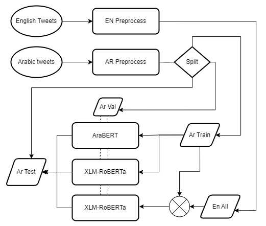
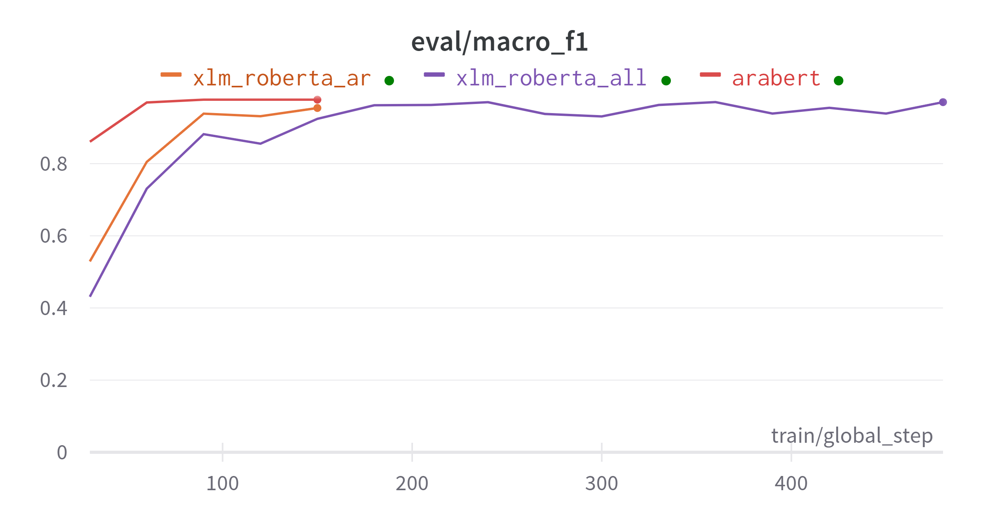
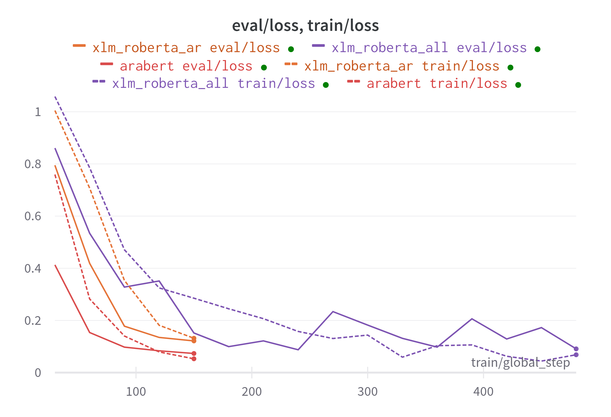

# Real or Fake or Satire? Comparison between Monolingual and Multilingual Settings

**Note:** Check at the bottom for a description on what does this repository contain. 

# Project Description
Experiments on the binary classification of news as real or fake and fake or satire are common in Arabic literature. Nevertheless, research on multi-label classification for the three classes together is non-existent, at least to my knowledge.

In this experiment, we try to experiment on the multilabel classification of tweets as Real, fake, and satire. For this, we will be using AraBERT [1], and XLMRoBERTa [2] pre-trained models. I have created a hybrid dataset that contains tweets I collected recently along with some data from the literature.

While we do multilabel classification, we want to explore the effects of multilingual settings on model performance. For this, I will experiment with training on XLMRoBERT Arabic training data that is augmented with English data points.

# Problem Definition

Given a tweet ***t*** that contains news in Arabic. Classify whether ***t*** belongs to one and only one of the following classes: **Real**, **Satire** or **Fake**. 

## What labels mean for this experiment
In this experiment I define the classes as following:
- **Real:** news tweets posted by a  reputable news organization
- **Fake:** news tweets that deemed by human annotators to contain false information.
- **Satire**: tweets that convey sarcasm in the style of news content.

# Methodology

## Data Collection

The dataset collected contains in total of 3552 tweets in Arabic and
English, 2208 of the tweets were collected personally using Twitter
API. The collection of the tweets was conducted between January
and March 2023. The rest of the tweets were retrieved from datasets
in the literature on COVID-19 Fake news. The following table describes the dataset and the sources of datapoints used:

| Source                  | Label  | Method                  | Number of Datapoints used |
|-------------------------|--------|-------------------------|------|
| [@AlHudoodNet](https://twitter.com/alhudoodnet)            | Satire | Manual, Twitter API             | 436  |
| [@AJABreaking](https://twitter.com/AJABreaking)            | Real   | Manual, Twitter API             | 465  |
| ARCOV19-Rumors [3]          | Fake   | From (Houari et al 2021)     | 311  |
| AraCOVID19-MFH [4]          | Fake   | From (Ameur & Aliane, 2021)  | 78   |
| NLP4IF-AR [5]               | Fake   | From (Panda & Levitan, 2021) | 69   |
|**Total Arabic Datapoints** |        |                         | **1359**|

| Source                     | Label  | Method             | Number of Datapoints used  |
|----------------------------|--------|--------------------|------|
| [@AlHudoodnetEN](https://twitter.com/AlHudoodnetEn)             | Satire | Manual, Twitter API        | 216  |
| [@TheOnion](https://twitter.com/TheOnion)                  | Satire | Manual, Twitter API         | 498  |
| [@AJENews](https://twitter.com/AJENews)                  | Real   | Manual, Twitter API         | 593  |
| COVID-19 Fake News Dataset [6] | Fake   | From (Patwa et al 2021) | 886  |
|   **Total English Datapoints** |        |                    | **2193** |

## Data Preprocessing
Links, hashtags, usernames, emojis, and news markers likes "عاجل" "Breaking.*" "Updates" and others were removed from the tweets. Also tweets with length size less than 35 chars where removed from the dataset. more information is included in the notebooks. 

## Machine Learning Models

The following lists the models and data used for each experiment 
1. AraBERT with Arabic training data
2. XLM-RoBERTa with Arabic training data
3. XLM-RoBERTa with Arabic training data + English data

All models are evaluated on Arabic evaluation data during training time and Arabic test data during testing time.

The following figure introduces the flowchart of this experiment:

## Models Training

Experiments on AraBERT and XLM-RoBERTA were
conducted with a unified set of paramaters: 
- Learning rate = 2e-5
- Batch size = 16
- Number of Epochs = 5.

## Evaluation Measures

Accuracy, Precision, Recall and F1-score were used as metrics for measuring the performance of the models.

# Models performance in training 

F1 scores on evalatuion set:

training vs validation loss:

# Test Results

The following table lists the performance results obtained from predicting on the arabic test set

|                          | F1    | Precision | Recall | Accuracy |
|--------------------------|-------|-----------|--------|----------|
| AraBERT with Ar          | 0.971 |   0.970   |  0.971 |   0.971  |
| XLM-RoBERTa with En & Ar | 0.967 |   0.967   |  0.968 |   0.967  |
| XLM-RoBERTa with Ar      | **0.974** |   **0.974**   |  **0.976** |   **0.974**  |

My initial expectation were that AraBERT will achieve the highest scores, and that data augmentation with english set will improve performance. 

The test results challenges my expectation with XLM-RoBERTa with just the arabic data performing the highest. Nevertheless, the margin of difference between the three experiments is very small to compare with.

Also the high performance scores may be attributed to one or some of the following reasons:
1.  Dataset collection was based on specific twitter accounts, the models could have learned the writing style of the accounts
2. The fake set for both arabic and english tweets are related to COVID-19 pendemic. thus it could be easy to learn to classify tweets contain COVID-19 as fake. and that is supported by the accuracy result of "fake" label in the notebook. 

Future project should collect tweets from diverse sources for the three labels. another challenge to work on is creating datasets of annotated claims in Arabic that is general and not related to COVID-19. 

# What can you find in this repository
 - **Notebooks**
 	- Notebooks folder contains two notebooks:
		- The first notebook uses tweepy to retrieve tweets using Twitter API, tweets  tweets are then filtered and preprocessed
		- The second notebook is for models training and evaluation.
		
- **Datasets**
	- Contains raw csv files of the data scrapped from Twitter and subset of the data used from the literature on COVID 19
	-  prepoccsed folder contains the final version of the dataset to be used to train and test the models

# References
1. W. Anton, F. Baly, and H. Hajj, ”AraBERT: Transformer-based Model for Arabic Language Understanding,”, 2020.

2.  Conneau, A., Khandelwal, K., Goyal, N., Chaudhary, V., Wenzek, G., Guzmán, F., ... & Stoyanov, V. (2019). Unsupervised cross-lingual representation learning at scale. arXiv preprint arXiv:1911.02116.

3. F. Haouari, M. Hasanain, R. Suwaileh, and T Elsayed, ”ArCOV-19: The First Arabic COVID-19 Twitter Dataset with Propagation Networks,”, In Proceedings of the Sixth Arabic Natural Language Processing Workshop, Kyiv, Ukraine (Virtual). Association for Computational Linguistics, pp. 82–91, 2021.

4.  M. S. Hadj Ameur and H. Aliane, “AraCOVID19-MFH: Arabic COVID-19 Multi-label Fake News and Hate Speech Detection Dataset” Procedia Computer Science, vol. 189, pp. 232–241, 2021

5. S. Shaar, F. Alam, G. Da San Martino, A. Nikolov, W. Zaghouani, P. Nakov, and A. Feldman, “Findings of the NLP4IF-2021 shared tasks on fighting the COVID-19 infodemic and censorship detection, Proceedings of the Fourth Workshop on NLP for Internet Freedom: Censorship, Disinformation, and Propaganda, 2021.

6.  Patwa, P., Sharma, S., Pykl, S., Guptha, V., Kumari, G., Akhtar, M. S., ... & Chakraborty, T. (2021). Fighting an infodemic: Covid-19 fake news dataset. In Combating Online Hostile Posts in Regional Languages during Emergency Situation: First International Workshop, CONSTRAINT 2021, Collocated with AAAI 2021, Virtual Event, February 8, 2021, Revised Selected Papers 1 (pp. 21-29). Springer International Publishing.
